# VapePOS - multi-branch point of sale

A cloud POS for a vape retailer with several shops. One central database, one login per person,
and every branch sees the same live picture of stock and sales.

**Stack:** React (Vite + TypeScript + Tailwind) - FastAPI (Python) - PostgreSQL - Docker

| Feature | What it does |
|---|---|
| Branch management | Admin creates branches with address, tax number, tax rate and custom receipt header/footer |
| Roles locked to a branch | Cashiers and managers can only see and sell from **their own** branch (enforced on the server). Admins see all locations or switch to one |
| Per-branch inventory | Stock per product per branch, low-stock alerts with per-item thresholds, stock ledger of every change |
| Vape product data | Flavor, nicotine type (freebase / salt) and strength, coil resistance (ohm), device variant, brand, barcode, cost and price |
| POS | Barcode scanner or search, cart, cash/card, change calculation, printable receipt. Two cashiers can never sell the last unit twice |
| Stock transfers | Pending -> In transit -> Received. Stock moves atomically when the destination confirms. Full audit trail |
| Analytics | Sales per branch per day, branch comparison, gross profit, top flavors, top devices, low-stock list |
| End of day (Z-Report) | Cash / card / tax totals per branch per day, cash-drawer count and variance, frozen once closed |
| Live sync | WebSocket push: a sale or transfer at one shop updates every other screen within a second |

## Screenshots

| | |
|---|---|
| **Point of sale** 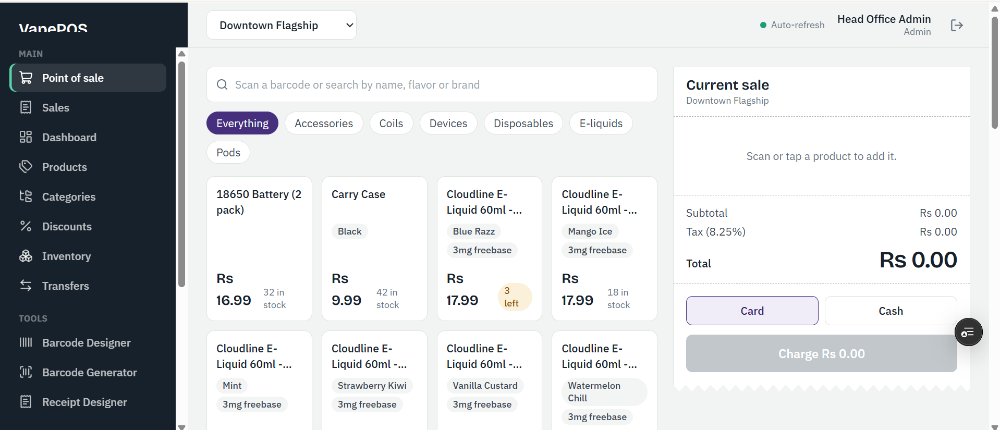 | **Dashboard** 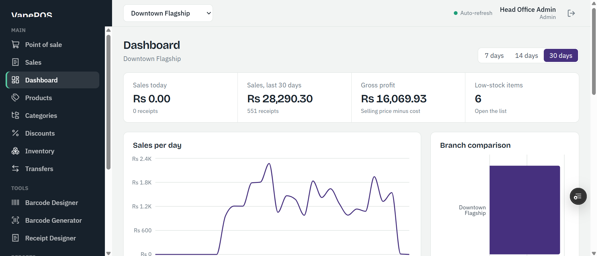 |
| **Sales history** 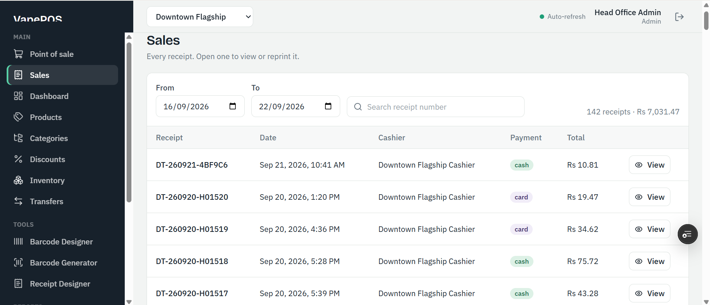 | **Products** 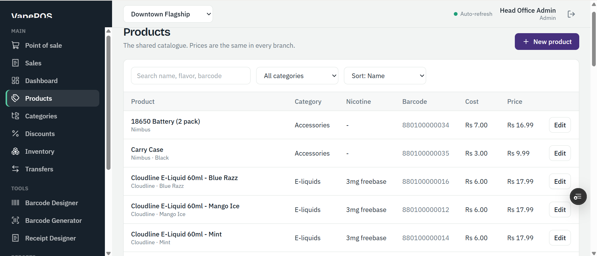 |
| **Categories** 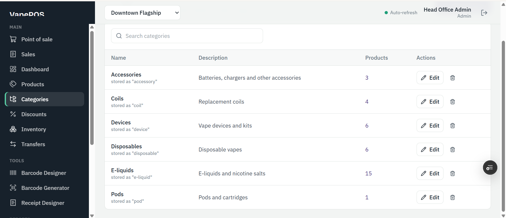 | **Discounts** 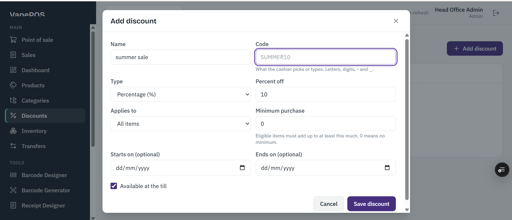 |
| **Inventory** 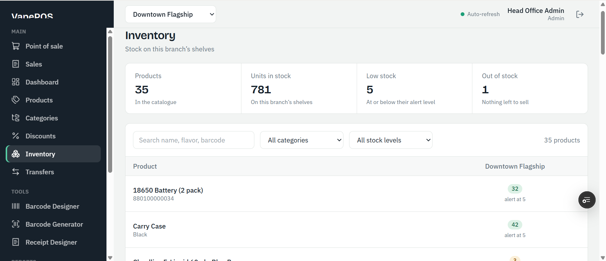 | **Transfers** 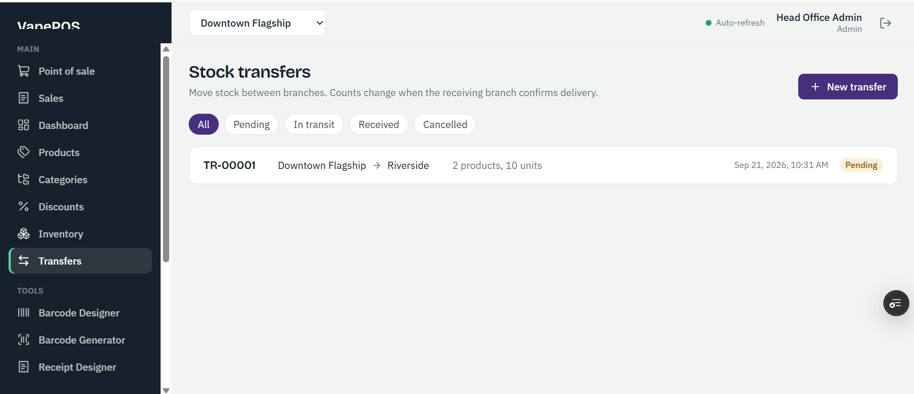 |
| **Barcode Designer** 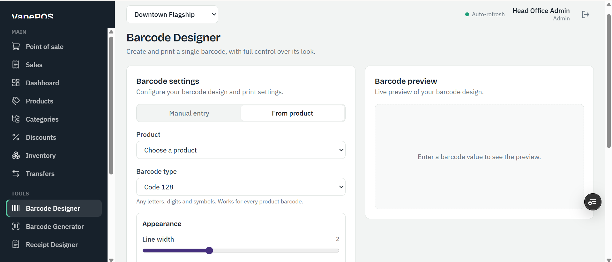 | **Barcode Generator** 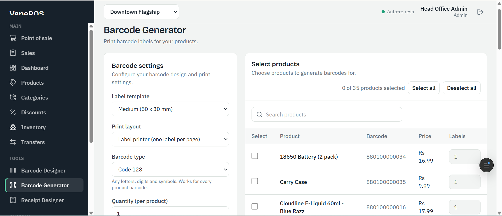 |
| **Receipt Designer** 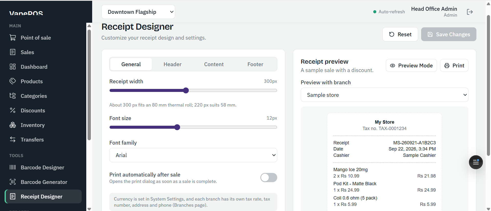 | **Reports** 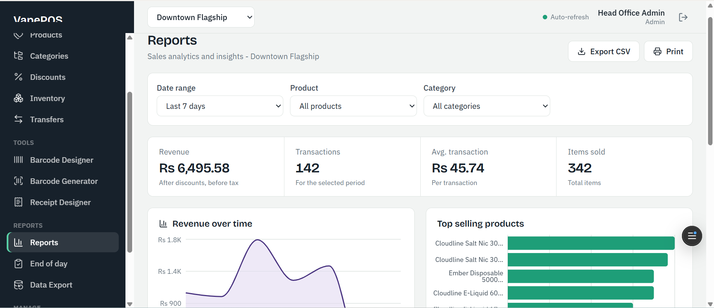 |
| **End of day** 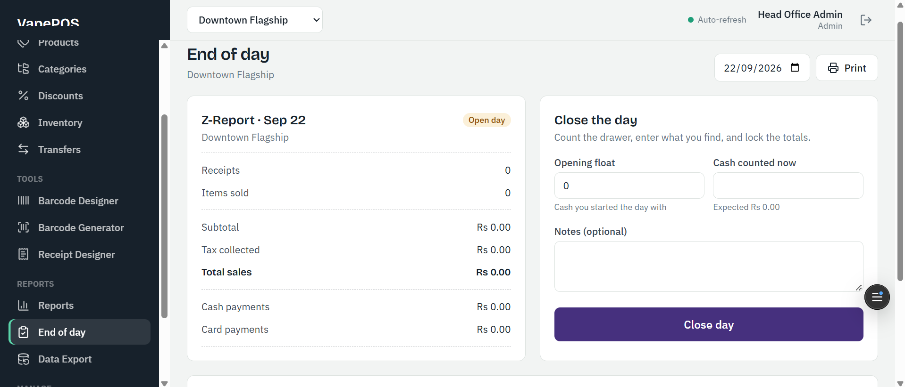 | **Data Export & Import** 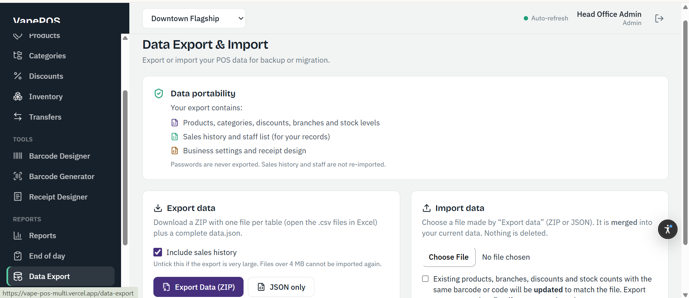 |
| **Branches** 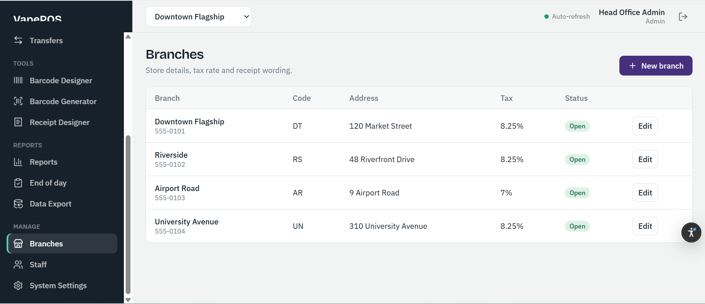 | **Staff** 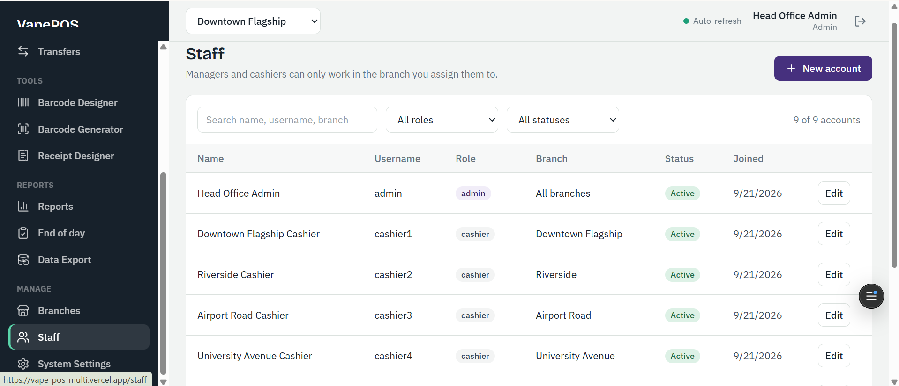 |
| **System Settings** 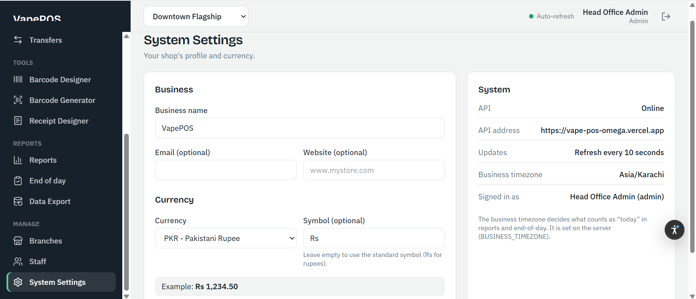 | **Login** 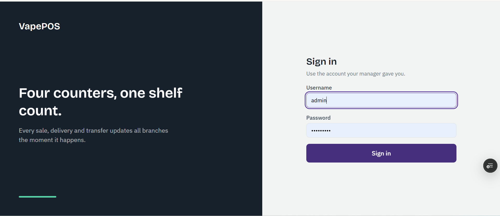 |

## Quick start with Docker (recommended)

You need [Docker Desktop](https://www.docker.com/products/docker-desktop/) (Windows/Mac) or Docker Engine + Compose plugin (Linux).

```bash
cp .env.example .env            # then open .env and fill in POSTGRES_PASSWORD and SECRET_KEY
                                #   openssl rand -hex 16   -> POSTGRES_PASSWORD
                                #   openssl rand -hex 32   -> SECRET_KEY
docker compose up -d --build    # first build takes a few minutes
docker compose exec backend python -m app.seed    # optional: demo data (4 branches, products, 3 weeks of sales)
```

Open **http://localhost:8080**.

Demo logins (only exist if you ran the seed command - **delete or change them before real use**):

| Role | Username | Password | Sees |
|---|---|---|---|
| Admin | `admin` | `admin1234` | All branches |
| Manager | `manager1` ... `manager4` | `manager1234` | Only their own branch |
| Cashier | `cashier1` ... `cashier4` | `cashier1234` | Only their own branch, POS-focused menu |

Without demo data there are no users yet. Create your own admin (it asks for a username and password):

```bash
docker compose exec backend python -m app.create_admin
```

The interactive API documentation is at **http://localhost:8080/api/v1/docs**.

## Local development (without Docker for the app itself)

Needs Python 3.12+, Node 20+ (22 recommended) and a PostgreSQL database: either a local server,
or a free [Neon](https://neon.com) database (no install; see `docs/WINDOWS_GITHUB_CLOUD.md`).

**Run every command from the folder named in the comment. Type one line at a time.**
The commands below work in PowerShell, macOS and Linux unless a comment says otherwise.

```bash
# --- Terminal 1: backend --------------------------------------------------------
cd backend
python -m venv .venv                   # once.  (PyCharm users: your project .venv is fine, skip this)
#   activate:  macOS/Linux:  source .venv/bin/activate     Windows PowerShell:  .venv\Scripts\Activate.ps1
pip install -r requirements-dev.txt
cp .env.example .env                   # Windows PowerShell:  Copy-Item .env.example .env
#   open backend/.env and set DATABASE_URL (a Neon or local PostgreSQL string) and BUSINESS_TIMEZONE
alembic upgrade head                   # create the tables
python -m app.seed                     # OPTIONAL demo data.   Or: python -m app.create_admin  (your own admin)
uvicorn app.main:app --reload          # API on http://localhost:8000/api/v1/docs

# --- Terminal 2: frontend -------------------------------------------------------
cd frontend
npm install
npm run dev                            # app on http://localhost:5173
```

Run the tests (they **erase** their database, so it must be a separate one whose name contains `test`):

```bash
createdb vapepos_test                  # local PostgreSQL; or set TEST_DATABASE_URL to another test database
cd backend
python -m pytest
```

## Hosting online

* **Your own server / VPS with Docker:** `docs/DEPLOYMENT.md`
* **Windows setup, GitHub, Neon (database) + Vercel (website and API):** `docs/WINDOWS_GITHUB_CLOUD.md`

## Project layout

```
vape-pos/
  docker-compose.yml        starts db + backend + frontend
  .env.example              settings for Docker (copy to .env)
  backend/                  FastAPI application
    app/models.py             database tables
    app/schemas.py            request/response shapes
    app/routers/              one file per area (auth, sales, transfers, ...)
    app/services/             shared logic (stock locking, business-day math)
    app/realtime.py           WebSocket broadcast
    app/seed.py               demo data
    alembic/                  database migrations
    tests/                    automated tests (real PostgreSQL)
  frontend/                 React single-page app
    src/pages/                one file per screen
    src/components/           UI kit, layout, receipt
    src/store/                small global state (login, selected branch, toasts)
    nginx.conf                production web server + API proxy
  docs/
    TOOLS_GUIDE.md            a guide to EVERY tool used, and how to use it here
    ARCHITECTURE.md           data model, permissions, transfer lifecycle, design decisions
    DEPLOYMENT.md             putting it on a server with HTTPS, backups, updates
    WINDOWS_GITHUB_CLOUD.md   Windows/PyCharm setup, GitHub push, Neon + Vercel hosting
    API_REFERENCE.md          every endpoint
```

## Where to read next

1. **docs/TOOLS_GUIDE.md** - what each tool is, why it is here, the commands you will use.
2. **docs/ARCHITECTURE.md** - how the pieces fit, and the decisions behind them.
3. **docs/DEPLOYMENT.md** and **docs/WINDOWS_GITHUB_CLOUD.md** - going live.

## A note on the reference project

The brief pointed at the open-source `kroma-pos` repository as a blueprint. That project is a
Next.js, offline-first, single-store app with a browser database and no license file, so it cannot be
turned into a multi-branch cloud system by "upgrading" it, and its code was not copied. VapePOS is a
fresh build to your stack (React + FastAPI + PostgreSQL) that covers the same kind of POS features.
